# COVID PATIENT HEALTH MONITORING
The IoT based Covid Patient Health Monitoring project is a state-of-the-art system that leverages NodeMCU 32SLUA/ESP8266 to provide continuous monitoring of patients' blood oxygen levels. This system is particularly designed for patients requiring round-the-clock monitoring, such as those with Covid-19 or those on ventilators.

The system logs the blood oxygen level data to the ubidots IoT platform, providing healthcare professionals and family members with real-time access to patient condition information.

Moreover, this cutting-edge system incorporates advanced features that enable it to send critical medical alerts, including voice calls, SMS, EMail, and Telegram messages, to both hospital management and patient loved ones. This is made possible through the use of Ubidots events and alerts features, which enable prompt and efficient dissemination of critical medical information.

By harnessing the power of IoT technology, this system provides an unprecedented level of monitoring and connectivity, which is crucial in responding to critical medical situations. This is particularly significant in the case of Covid patients and those on ventilators, where time is of the essence.

Overall, the IoT based Covid Patient Health Monitoring project is a remarkable and life-saving solution that showcases the immense potential of IoT technology in advancing healthcare outcomes. It exemplifies the resourcefulness and innovation of engineers and medical professionals working together to tackle the unique challenges of the modern era.

## Schematic

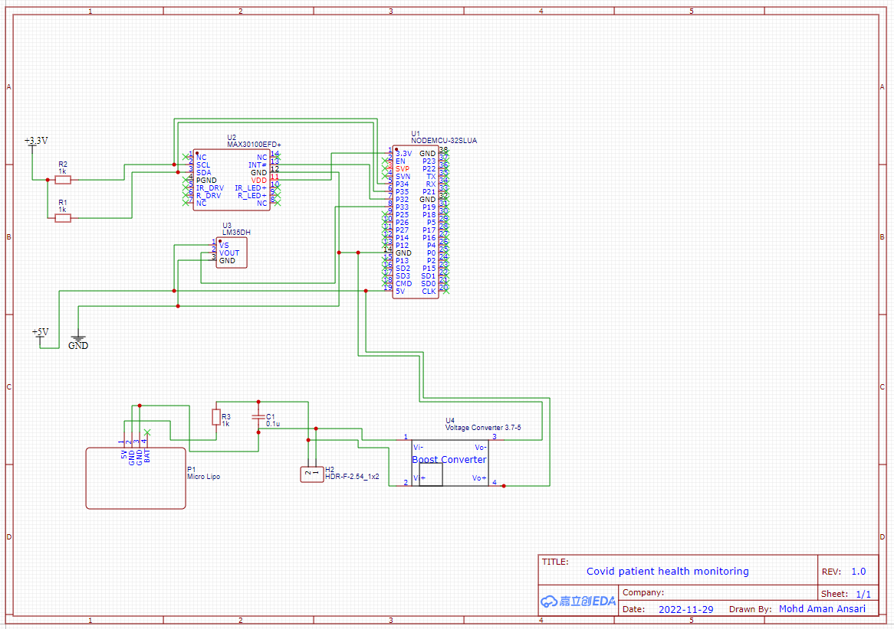

### PCB

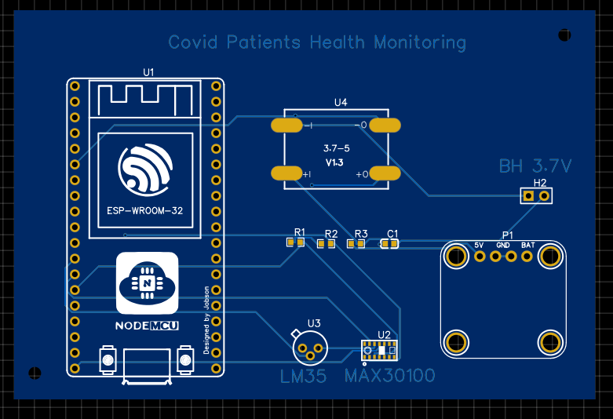

### 3D view

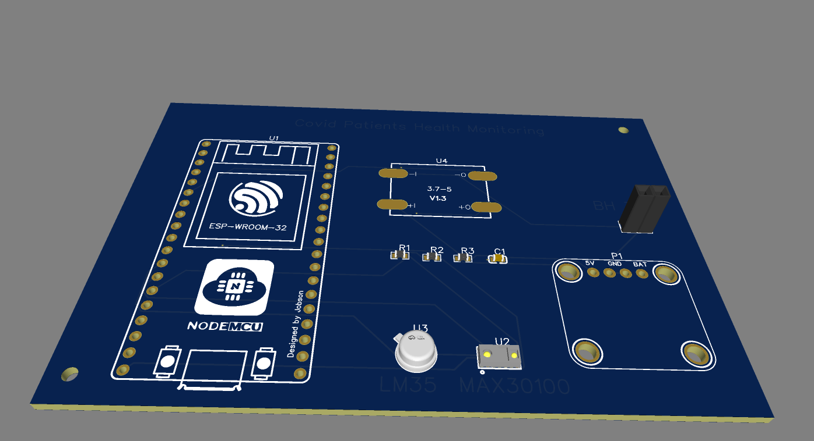

### 3D view

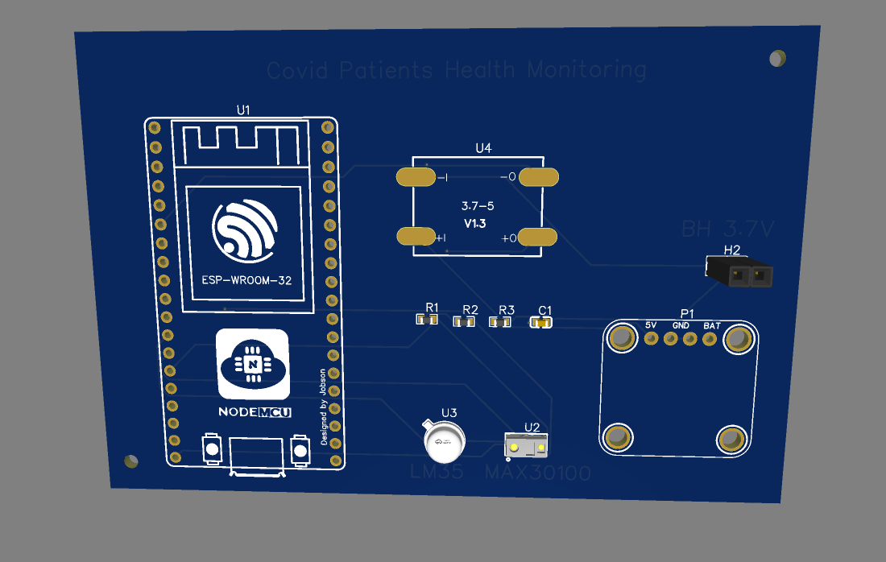

## Creating device in Ubidots
Before jump into the programming, part let’s create a device in the Ubidots Platform for our solution. follow the below steps.

1-Visit ubidots.com
\
2-Go to Dashboard
\
3-Click on devices
\
4-create a new device, select a blank device
\
5-Enter the name for the device then click on this green tickmark to create the device.

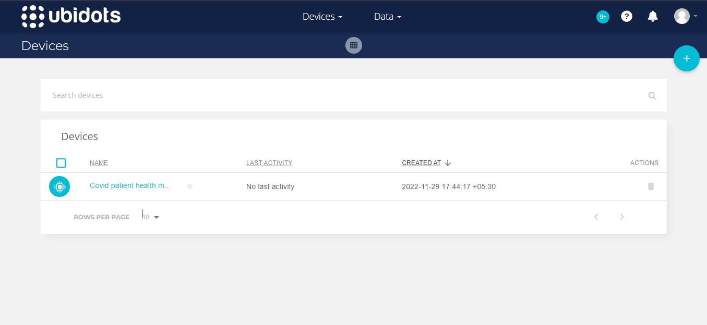

## Configuring Critical Medical Alerts using Ubidots Event Function
Follow the below steps to configure Critical Medical alerts using Ubidots Events Engine.

1-Select Events from the Data dropdown.
\
2-Click on the create event button.
\
3-Select the If triggers tab to organize your event logic.

First, we will create a condition to trigger the event and then call appropriate action to take place. I wanted to use SPo2 data for conditional expression so, I have selected SPo2,

1-Click on Select variable,
\
2-Select the device: Oxygen monitor,
\
3-Select the variable SPo2.

Establish event logic if the value is less than or equals to 95%, for 1 minute.

That’s it, event logic for the If triggers tab is completed.

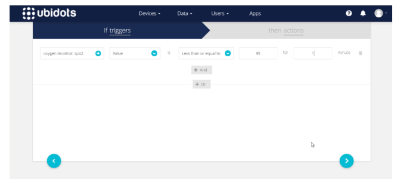

Select the Then actions tab to execute the planned Event or Alert such as Email, SMS, Telegram, Voice Call, Slack, or Webhook.

Click on add new action, Select and Configure which actions are to be executed and the message for the receiver. Available actions include Email, SMS, Telegrams, Voice Call, Set Variable, SLACK, or WebHooks.

For this solution I would like to configure Email, SMS, Telegrams, Voice Call, First of all, I would like to configure email.

Enter the Email address, we can add 2 or more emails by simply separating them with a comma. then type the alert mail subject and message as you wish. you can also Add Specific Data Inputs like Variable Name, Device Label, Trigger Value, Trigger Timestamp into the Event for the immediate info after configuring the message create it.

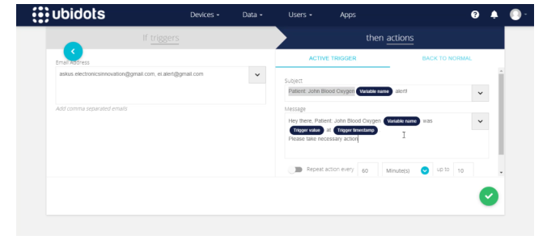

likewise, we can configure and create the rest of the alerts like SMS, Telegram Message, and Voice call.
All you have to do is providing the target mobile no along with the country code and the alert message.

For voice call, you can select the voice of the alert message between John and Alice whereas john is a male voice and Alice is a female voice. then the rest of the details are as same as SMS and telegram message.

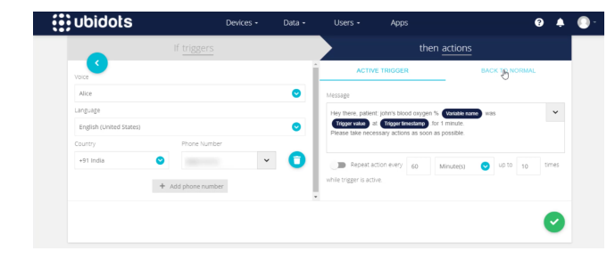

So, all these alerts are triggered when the Spo2 value is less than or equals to 95%, for 1 minute.

After creating an Alert, it is inevitable that the event will be triggered at some point;
one great feature of Ubidots Events Engine is the “Back to Normal” conditional notification. it will send us another alert if the triggered value came back to normal.
To activate a Back to Normal notification, simply follow the below three steps.

Select the “BACK TO NORMAL” tab from the event’s actions tab.

Select the “Trigger this action” box to verify the desire to receive a “back to normal” notification.

Add the Custom Notification Text as you see fit, then save action.

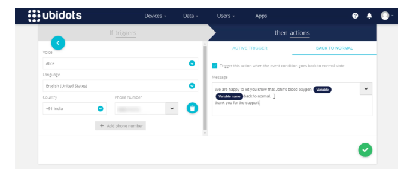

likewise enable the back to the normal notification to the rest of the Telegram message, SMS, and Email alerts.

After configuring all alerts click on next.

Here you can give a meaningful name to your event and Determine when should the events to be executed and not executed.
\
For our solution, we have to monitor the patient oxygen levels 24×7 so keep it default and save it.

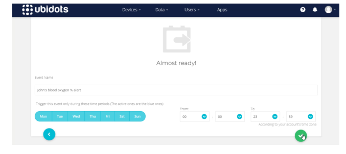

Now, it’s time to test this event. So come back to the dashboard. here the data can be updated seamlessly.

To make Spo2 less than 95% remove the finger from the top of the sensor, so it will send 0 reading which will satisfy the event condition. then wait for 1 minute, to get event alerts.

Yes After 1 minute, we have received a voice call from ubidots, Also received the SMS. you can read the text in the below picture which is the same as we configured. We also received telegram message from IoT notifications, maybe IoT notifications is the bot created by ubidots. anyway, we have received the Telegram alert. Mail also received from notifications ubidots, with the Subject and mail body we have configured on the event.

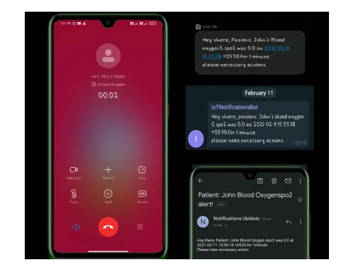

So, all 4 alerts were triggered and sent to the configured receiver. For demonstration, I have provided my mobile no, for real-time scenarios we can simply replace my no with hospital management, patient care takes, or patient loved ones.

Now, it’s time to test the “back to the normal” alert feature.

To make this Spo2 greater than 95% I am gonna place my finger on top of the sensor, so it will send the exact readings of my body which will satisfy the event condition to trigger back to normal alert.

Yes After 1 minute, we have received a voice call from ubididots again, zing zing amazing.likewise, we have received SMS alert, and Telegram message alert from the IoT notification, also we have received the Mail from notifications ubidots, with the Subject and mail body we have configured on the back to the normal event.

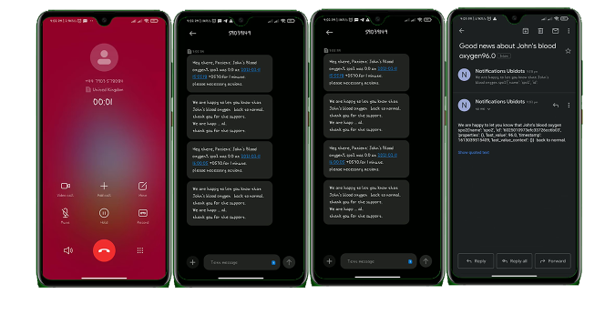
## Where do we place the device

We can use as wrist hand watch.
\
Due to this we can use accurate data of MAX30100 sensor which is measure the data like SPO2 and Heart beat of a patient.
\
We use tempreture sensor as LM35 beside the MAX30100 sensor which monitor the body tempreture of a patient.

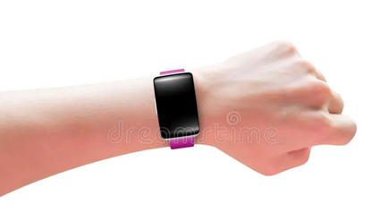

## Hospital Management

In hospital mangement, a person or worker can update all the related things regarding covid patients like availability of beds, ICU wards, ventilators, oxygen cylinders etc on the dedicated web portal, so that the pateint or relative person can easily find.
\
In this we use or make a web portal for client as well as users to see in realtime of what hospital are at nearest position and how many beds are free or not reserved.
\
The cleint(hospital mangement worker) updated the realtime data in the web portal. 